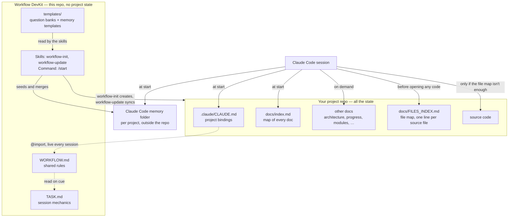

# Claude Workflow DevKit

> **The DevKit contains the workflow. The project contains the state.**

Claude Workflow DevKit is a project-agnostic development methodology for Claude Code. You inject
it into a repository, and it sets the rules for how the AI orients itself each session, documents
and tracks work, and hands off cleanly to the next session. The project keeps all the state.

It isn't a plugin. It's a reusable way of working — rules, documentation conventions, and a
scaffolding assistant — that happens to be implemented for AI-assisted development. Connect a
project once, and every later improvement to this repo reaches it automatically, with no files to
copy around.

## Why This Exists

The model can write the code, but the development process tends to disappear between sessions.
Every project that uses Claude Code ends up needing the same infrastructure: rules for how the AI
should behave across sessions, a documentation structure that doesn't drift out of sync with the
code, and a way to pick up exactly where the last session left off instead of re-deriving context
from scratch — or worse, from a stale memory of it. Without a shared system, that infrastructure
gets hand-rolled per project: a `CLAUDE.md` copy-pasted from the last repo and tweaked,
conventions that quietly diverge, fixes learned the hard way in one place that never reach the
others.

This repo is that shared system, extracted from real, repeated use rather than designed up front.
The core idea: **improvements should compound, not get re-invented.** When a workflow rule turns
out to be wrong, it gets fixed once, here, and every connected project has the fix at its next
session. A project's own `CLAUDE.md` stays small and specific to that project; the shared,
evolving parts live in one place.

It's also **language- and project-agnostic on purpose**. The scaffolding assistant works from
question banks, not hardcoded assumptions — a new language or project type extends the system by
answering questions, not by someone predicting every project shape in advance.

## What It Defines

- **How a session starts** — a fixed boot sequence, and a single "Next Session Entry Point" that
  says what to do next, so a session never has to guess.
- **What enters the context, and when** — see [Context Management](#context-management) below.
- **Who does what** — design is collaborative, documentation is the AI's job, implementation and
  tests are the user's. See [Learning-First by Default](#learning-first-by-default).
- **Which documents exist and how they're structured** — a doc index, an architecture overview,
  module docs with a naming convention that mirrors the code, a file map, a known-issues list.
- **How progress is recorded** — an append-only progress log, and consolidated patch notes on
  request, with older ones archived.
- **When documentation gets updated** — a doc audit at the end of every task, so docs change in
  the same commit as the work they describe.
- **How a session wraps up** — memory left ready for a cold start; near the context limit, state
  is saved before the conversation is compacted, not after.
- **When commits happen** — "prepare a commit" means audit, stage and summarize; the commit itself
  only happens when you say so.
- **Reinforcement in memory** — the rules above are also seeded into Claude Code's per-project
  memory, where they get broken far less often than rules that only live in instruction files.

## Learning-First by Default

The workflow is opinionated: it's built for developers who want to understand and own their code,
not for hands-off generation. By default the AI discusses design in prose, gives hints, asks
leading questions, and reviews what you wrote — you write the implementation and the tests. It
writes code only when you ask for it explicitly: one logical unit by default, or exactly the scope
you name ("write all the tests for X").

If you want the AI to generate most of the code, this kit isn't a drop-in fit as-is. Project rules
in a project's own `CLAUDE.md` or memory take precedence over the shared defaults, but the defaults
assume learning-first.

## Context Management

Instead of putting every instruction and document into `CLAUDE.md` and hoping the model keeps
everything straight, the workflow defines a documentation hierarchy and rules for when
information enters the context:

- **At session start, only a little is loaded:** the project's small `CLAUDE.md` (with the shared
  workflow it imports), the memory index, the session rules in `TASK.md`, and `docs/index.md` — a
  one-line summary of every doc, used as the map.
- **Everything else loads on demand:** progress logs, module docs, and source files are read only
  when the current task needs them. Before opening any code file, the session checks the file map,
  which often answers the question without opening the file at all.
- **Docs stay findable:** past about 300 lines, a doc gets checked for a natural seam to split
  along; if it has none, it stays whole and gets better internal navigation instead.
- **Near the context limit**, the session writes its state to memory and suggests a clean restart,
  rather than relying on automatic compaction to keep what matters.

The goal is that a session starts with a small amount of information, works out what it's doing,
and progressively loads only what's relevant.

## Quick Start

**1. Clone this repo somewhere stable.** Anywhere on disk works, as long as you don't move it
afterward (or re-run step 2 if you do).

```
git clone <this-repo-url> claude-workflow
```

**2. Make its skills and commands available to Claude Code.** This is a one-time, per-machine
step — it makes `/workflow-init`, `/workflow-update`, and `/start` available in *every* project
you use Claude Code on afterward, not just one.

macOS/Linux:
```
ln -s "$(pwd)/claude-workflow/.claude/skills/workflow-init"   ~/.claude/skills/workflow-init
ln -s "$(pwd)/claude-workflow/.claude/skills/workflow-update" ~/.claude/skills/workflow-update
ln -s "$(pwd)/claude-workflow/.claude/commands/start.md"      ~/.claude/commands/start.md
```

Windows (run from `cmd.exe`, not git-bash — git-bash's `ln -s` can silently make a plain copy
instead of a real symlink on Windows; `mklink` doesn't have that problem, though it may need
Developer Mode enabled or an elevated prompt):
```
mklink /D "%USERPROFILE%\.claude\skills\workflow-init"   "<full-path-to>\claude-workflow\.claude\skills\workflow-init"
mklink /D "%USERPROFILE%\.claude\skills\workflow-update" "<full-path-to>\claude-workflow\.claude\skills\workflow-update"
mklink      "%USERPROFILE%\.claude\commands\start.md"    "<full-path-to>\claude-workflow\.claude\commands\start.md"
```

A brand-new skill needs one fresh Claude Code session to be noticed for the first time — open a
new session after running the commands above.

**3. Connect a project.** Open (or `cd` into) the project you want to set up, start a Claude
Code session there, and run:

```
/workflow-init
```

It asks what language and kind of project this is and a handful of questions about it, scans for
your build/test commands, and writes everything: `.claude/CLAUDE.md`,
`docs/PRODUCT_REQUIREMENTS.md`, the rest of the doc skeleton, `.gitignore`, and Claude Code's own
config files. It also seeds the project's Claude Code memory with the workflow's reinforcement
memories. It won't touch anything that already exists without asking first, and it never commits
on its own — review what it made, and commit when you're happy with it.

**4. From now on, just run `/start`** at the beginning of any session in that project.

That's the whole workflow. Everything past this point is what's happening under the hood, for
anyone who wants to understand it or extend it.

---

## What `/workflow-init` creates in your project

```
.claude/
  CLAUDE.md                     — project bindings + @import of this repo's WORKFLOW.md
  workflow-meta.json            — records which language/project-type templates were used
  settings.json                 — sensible Claude Code session defaults
  settings.local.json           — personal, gitignored (additionalDirectories → this repo)
  settings.local.json.example   — committed template of the above, path placeholder'd out
docs/
  index.md                      — master index of every doc file
  PRODUCT_REQUIREMENTS.md       — the PRD, from the PRD dialog
  ARCHITECTURE.md               — thin skeleton for a new project (module status table)
  PROGRESS.md                   — empty append-only milestone tracker
  FILES_INDEX.md                — file map: empty if there's no code yet, populated from it otherwise
  KNOWN_ISSUES.md               — empty shell
  modules/                      — empty until real code exists for a module
  patch_notes/
    archive/INDEX.md            — empty shell
context_dir/
  .gitkeep
.gitignore                      — workflow-universal entries + your language's gitignore fragment
```

Plus, outside the repo, in the project's Claude Code memory folder:

```
MEMORY.md                       — memory index; its Next Session Entry Point drives /start
feedback_*.md                   — reinforcement memories for the workflow's rules (generic ones,
                                  plus any your language/project-type template declares)
```

Nothing is committed automatically — review it, then commit when you're happy with it. The memory
files are personal and never part of a commit.

---

## How it works



**A project's `CLAUDE.md` stays tiny.** It holds only project-specific things (name, build/test
commands, paths, language rules) plus a single line — `@<path-to-this-repo>/WORKFLOW.md` — that
pulls in everything else. Claude Code's `@path` import re-resolves that file fresh at every
session start (confirmed directly, not assumed), so an edit to `WORKFLOW.md` here is live in every
connected project, with no sync step.

**Skills and commands are discovered, not imported.** Claude Code scans `~/.claude/skills/` and
`~/.claude/commands/` at session start; it doesn't follow an `@path` reference for these the way
it does for `CLAUDE.md` content. That's why Quick Start step 2 sets up symlinks: the personal
directory just points at the real files in this repo, so there's one copy, not two that can
drift apart.

**The template system.** `templates/generic.md` (every project), `templates/languages/<lang>.md`
and `templates/projects/<type>.md` are question banks, not prose to copy in verbatim — static
rules only where something is genuinely non-negotiable (e.g. "C++ code must compile to a
standard"); everything else is a question whose answer becomes project-specific text.
`templates/prd.md` does the same for the requirements document, kept separate so PRD content and
`CLAUDE.md` content never get tangled. See `templates/TEMPLATE_RULES.md` for the full design
rules, including using web search mid-dialog to fill gaps rather than guessing.

**Memory templates.** Rules in imported `.md` files alone turned out not to be enough — the same
rules reinforced in Claude Code's per-project memory get broken far less often. So
`/workflow-init` also seeds the project's memory from `templates/memory/`: generic memories for
every project, plus any a language or project-type template declares, some of them conditional on
a yes/no answer. Memory is a copy, not an import — that's what `/workflow-update` is for. It
merges kit improvements into seeded memories like a git three-way merge, so a project that
deliberately overrode part of a memory keeps its override and still gets updates to the rest.

**Keeping a connected project current.** `/workflow-update` diffs an already-connected project's
docs and seeded memories against however the templates they were built from have since changed,
and pulls in just the differences.

**Maturity.** `/workflow-init` has been validated only through simulated dialogs against an
existing project, not yet end to end on a real brand-new project; memory seeding and memory
merging are newer still and untested, and `/workflow-update` is a first pass. Expect rough edges
on first real use.

## Repo structure

```
WORKFLOW.md                          — the imported, always-loaded workflow core
TASK.md                              — session mechanics, read on cue (not auto-loaded)
templates/
  README.md                          — what's in this folder (explanation only)
  TEMPLATE_RULES.md                  — shared design rules for every template (used by the skills)
  DOCUMENTATION_STYLE.md             — how generated docs get formatted/assembled (laws + guidelines)
  generic.md                         — applies to every project: generic questions + generic memories
  languages/<lang>.md                — per-language static rules + question bank + gitignore fragment
  projects/<type>.md                 — per-project-type question bank
  prd.md                             — PRD question bank + output structure
  memory/                            — MEMORY.md skeleton + memory bodies (README explains the mechanism)
  settings.json.example              — universal Claude Code session-tuning defaults (no model pin — model/effort are per-user)
  settings.local.json.example        — universal Claude Code permissions baseline
.claude/
  skills/workflow-init/SKILL.md      — scaffolds a new/existing project
  skills/workflow-update/SKILL.md    — updates an already-connected project
  commands/start.md                  — session bootstrap command
CONTRIBUTING.md                      — rules and validation method for changing this repo
LICENSE                              — MIT
```

## Feedback

Criticism of the workflow itself is the most useful kind: rules that are unnecessary, things
it overlooks, or approaches you use that solve the same problem better. Open an issue — or read
`CONTRIBUTING.md` if you'd like to change something yourself.

## License

MIT — see [LICENSE](LICENSE).

## Disclaimer

Claude Workflow DevKit is an independent community project and is not affiliated with, sponsored
by, or endorsed by Anthropic. Claude and Claude Code are trademarks of Anthropic, PBC.
